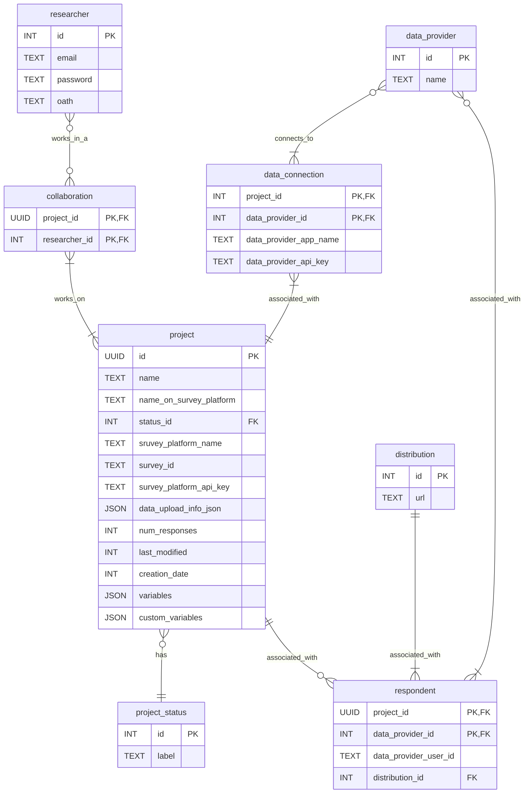
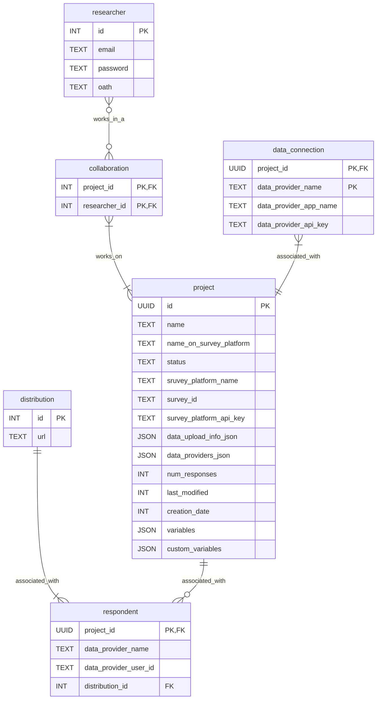

# Database

## Simplest Database

Simple Database layout using a JSON field to store the state of the variables for each project:

```mermaid
erDiagram
  researcher {
    INT id PK
    TEXT email 
    TEXT password 
    TEXT oath 
  }
  
  project_status {
    INT id PK
    TEXT label 
  }
  
  data_provider {
    INT id PK
    TEXT name 
  }
  
  collaboration {
    UUID project_id PK, FK
    INT researcher_id PK, FK
  }
  
  data_connection {
    INT project_id PK, FK
    INT data_provider_id PK, FK
    TEXT data_provider_app_name
    TEXT data_provider_api_key 
  }
  
  project {
    UUID id PK
    TEXT name 
    TEXT name_on_survey_platform
    INT status_id FK
    TEXT sruvey_platform_name
    TEXT survey_id 
    TEXT survey_platform_api_key
    JSON data_upload_info_json
    INT num_responses
    INT last_modified
    INT creation_date 
    JSON variables
    JSON custom_variables
  }
  
  distribution {
    INT id PK
    TEXT url
  }
  
  respondent {
    UUID project_id PK, FK
    INT data_provider_id PK, FK
    TEXT data_provider_user_id
    INT distribution_id FK
  }
  
  researcher }o--o{ collaboration : works_in_a
  collaboration }|--|{ project : works_on
  project }o--|| project_status : has
  data_provider }o--|{ data_connection : connects_to
  data_provider }o--|{ respondent : associated_with
  data_connection }|--|| project : associated_with
  distribution ||--|{ respondent : associated_with
  project ||--o{ respondent : associated_with
```

## Alternative Database (to be discussed)

```mermaid
erDiagram
  researcher {
    INT id PK
    TEXT email 
    TEXT password 
    TEXT oath 
  }
  
  collaboration {
    INT project_id PK, FK
    INT researcher_id PK, FK
  }
  
  data_connection {
    UUID project_id PK, FK
    TEXT data_provider_name PK
    TEXT data_provider_app_name
    TEXT data_provider_api_key 
  }
  
  project {
    UUID id PK
    TEXT name 
    TEXT name_on_survey_platform
    TEXT status
    TEXT sruvey_platform_name
    TEXT survey_id 
    TEXT survey_platform_api_key
    JSON data_upload_info_json
    JSON data_providers_json
    INT num_responses
    INT last_modified
    INT creation_date 
    JSON variables
    JSON custom_variables
  }
  
  distribution {
    INT id PK
    TEXT url
  }
  
  respondent {
    UUID project_id PK, FK
    TEXT data_provider_name
    TEXT data_provider_user_id
    INT distribution_id FK
  }
  
  researcher }o--o{ collaboration : works_in_a
  collaboration }|--|{ project : works_on
  data_connection }|--|| project : associated_with
  distribution ||--|{ respondent : associated_with
  project ||--o{ respondent : associated_with

```

