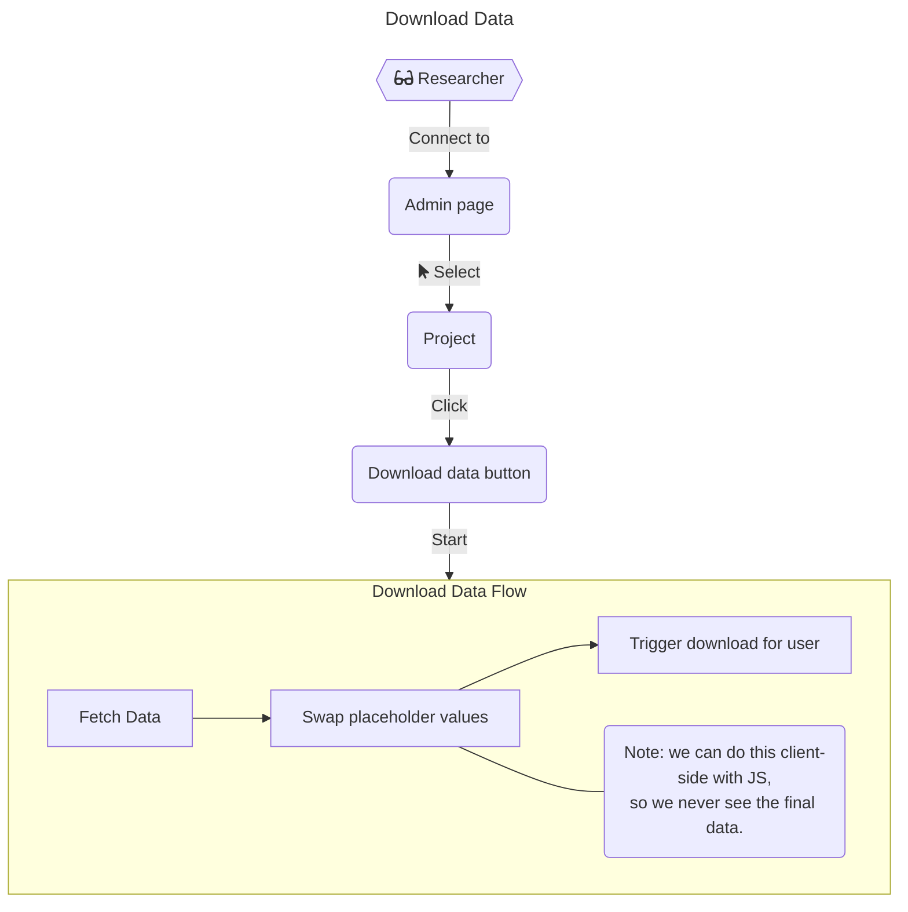

# Download Data Flow
# Administrator Flow

```mermaid
---
title: Download Data
---
flowchart TD
    R{{fa:fa-glasses Researcher}} --> | Connect to | admin_page(Admin page)
    admin_page --> | fa:fa-mouse-pointer Select | project(Project) --> |Click| download_data_button(Download data button)
    
    download_data_button --> |Start| download_data
    
    subgraph download_data [Download Data Flow]
        fetch_data[Fetch Data] --> swap_placeholder_values[Swap placeholder values] --> dl_final[Trigger download for user]
        
        swap_placeholder_values --- note(Note: we can do this client-side with JS,\nso we never see the final data.)
    end

```
