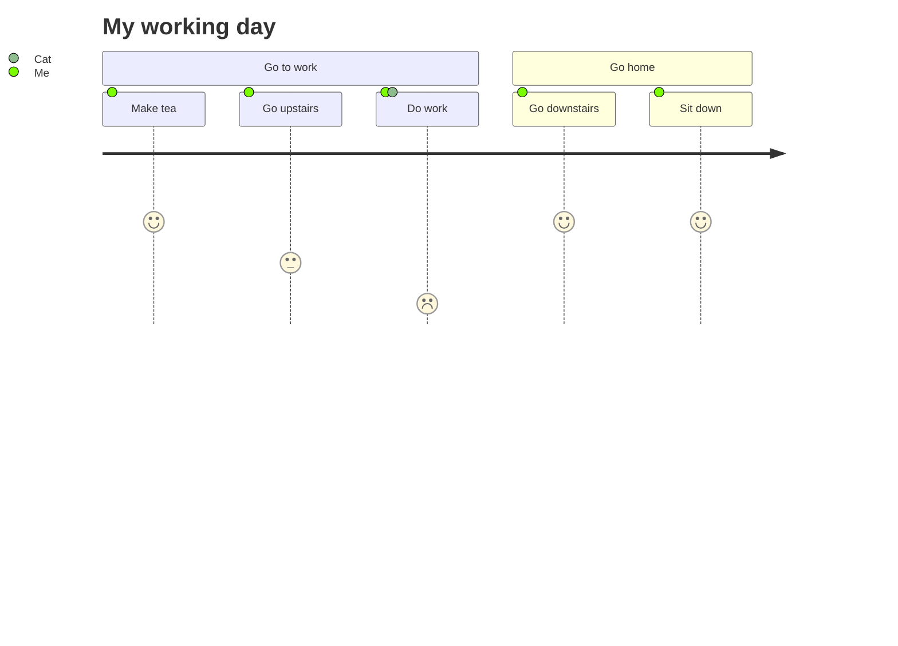
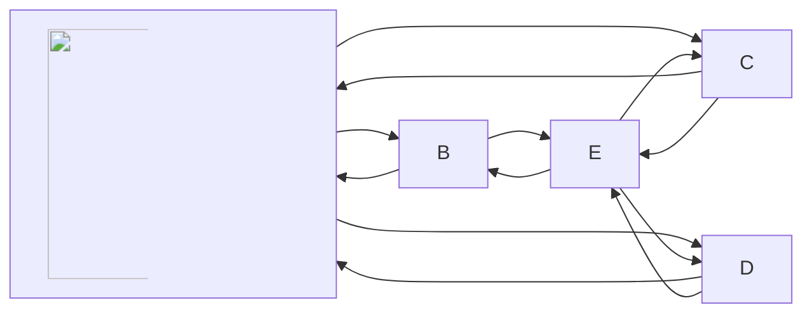

# Participant Journey Diagram

```mermaid
journey
    title My working day
    section Go to work
      Make tea: 5: Me
      Go upstairs: 3: Me
      Do work: 1: Me, Cat
    section Go home
      Go downstairs: 5: Me
      Sit down: 5: Me

```

```mermaid
%%{init: { "securityLevel": "loose", "flowchart": { "htmlLabels": true } } }%%

flowchart LR
    A["<img src='./Login.png' height='200px' width='200px'/>"]--> B & C & D;
    B--> A & E;
    C--> A & E;
    D--> A & E;
    E--> B & C & D;


```

