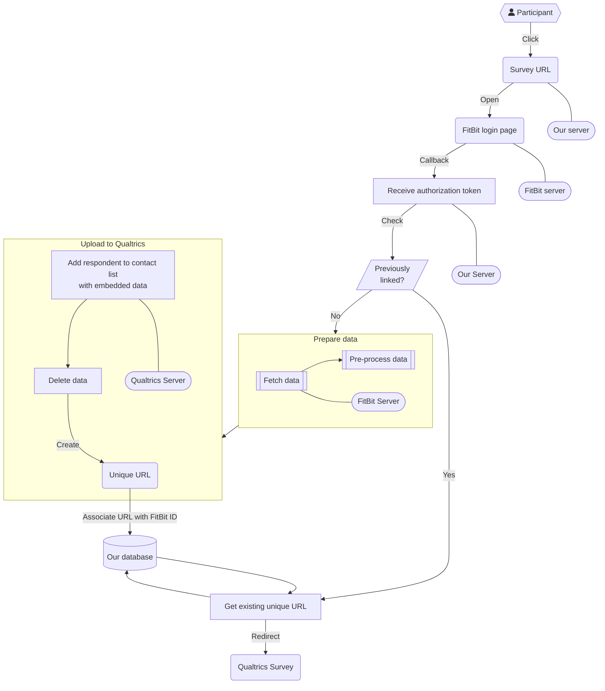

# Participant Flow

```mermaid
flowchart TD
    participant{{fa:fa-user Participant}} --> | Click | survey_url(Survey URL) --- our_server([Our server])
    survey_url --> | Open | fitbit_login_page(FitBit login page) 
    fitbit_login_page --- fitbit_server([FitBit server])
    
    click fitbit_login_page "https://dev.fitbit.com/build/reference/web-api/authorization/" _blank
    
    fitbit_login_page --> |Callback| send_token_to_us[Receive authorization token]
    send_token_to_us --- our_server2([Our Server])
    
    send_token_to_us --> |Check| account_previously_linked[/Previously\nlinked?/]
    
    account_previously_linked --> | Yes | get_existing_url[Get existing unique URL] --> | Redirect | qualtrics_survey
    get_existing_url --> our_database
    our_database --> get_existing_url
    
    account_previously_linked --> | No | prepare_data
    
    prepare_data --> upload_data
    
    unique_url --> | Associate URL with FitBit ID | our_database[(Our database)]
    
    qualtrics_survey(Qualtrics Survey)
    
    subgraph prepare_data [Prepare data]
        fetch_data[[Fetch data]] --> preprocess_data[[Pre-process data]]
        fetch_data --- fitbit_server2([FitBit Server])
    end
        
    subgraph upload_data [Upload to Qualtrics]
        add_respondent_to_contact_list[Add respondent to contact list\nwith embedded data] --- qualtrics_server([Qualtrics Server])
        
%%        add_respondent_to_contact_list --> upload_successful[/Upload\nsuccessful?/]
%%        
%%        
%%        upload_successful --> | No | retry_upload[Retry Upload] --> add_respondent_to_contact_list
        
%%        upload_successful --> | Yes | 
        add_respondent_to_contact_list --> delete_data[Delete data] --> | Create | unique_url(Unique URL)
    end

```
