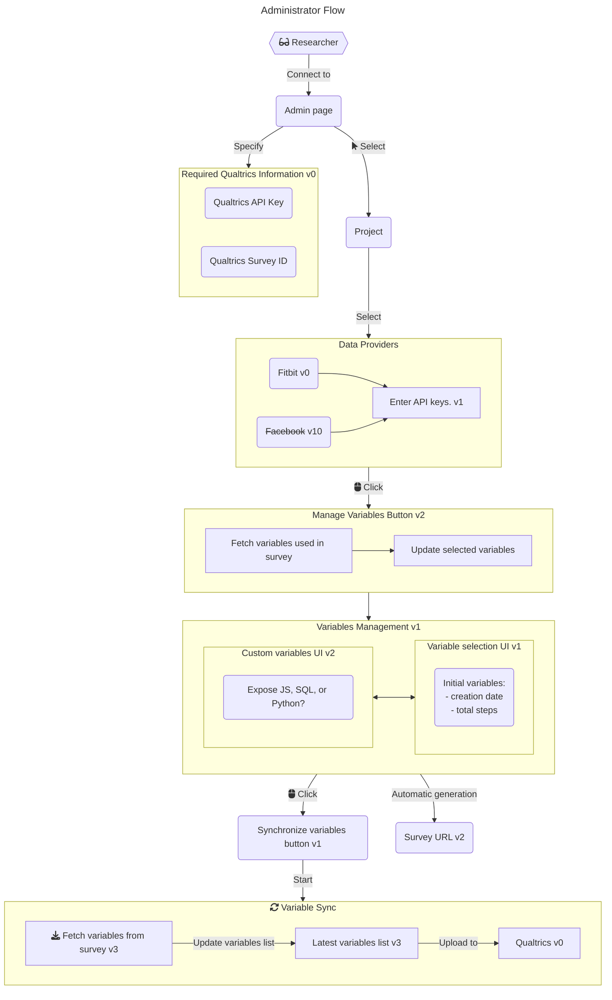

# Administrator Flow

%%---
%%title: Title example
%%---
%%flowchart LR
%%    A --> B
%%    subgraph name
%%    C --> D
%%    end
%%    id1([This is the text in the box])
%%    id2["This is the (text) in the box"]

%%stateDiagram-v2
%%    S1: The state with a note
%%    note right of S1
%%    This is note
%%    end note

%%classDiagram
%%class Square~Shape~{
%%    int id
%%    List~int~ position
%%    setPoints(List~int~ points)
%%    getPoints() List~int~
%%}
%%
%%Square : -List~string~ messages
%%Square : +setMessages(List~string~ messages)
%%Square : +getMessages() List~string~
%%Square : +getDistanceMatrix() List~List~int~~

%% This is comment

