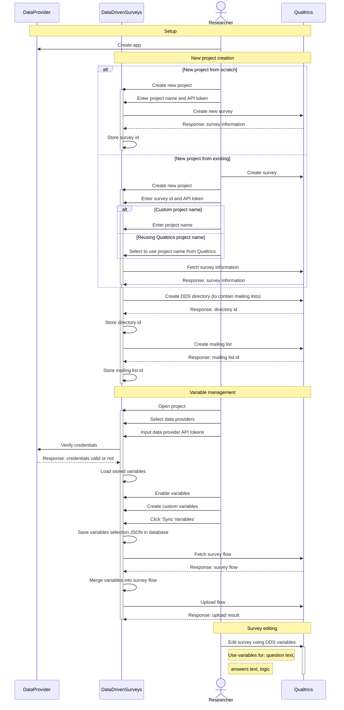

# Sequence Diagram: Researcher Creates and Uses a Project

```mermaid
sequenceDiagram
  participant dp as DataProvider
  participant dds as DataDrivenSurveys
  actor r as Researcher
  participant q as Qualtrics
  
  Note over dp,q: Setup
  r->>dp: Create app
  
  Note over dds,q: New project creation
  alt New project from scratch
    r->>dds: Create new project
    activate dds
    r->>dds: Enter project name and API token
    dds->>q: Create new survey
    q-->>dds: Response: survey information 
    dds->>dds: Store survey id
    deactivate dds
  else New project from existing
    r->>q: Create survey
    r->>dds: Create new project
    activate dds
    r->>dds: Enter survey id and API token
    
    alt Custom project name
        r->>dds: Enter project name
    else Reusing Qualtrics project name
      r->>dds: Select to use project name from Qualtrics
    end
    
    dds->>q: Fetch survey information
    q-->>dds: Response: survey information
    deactivate dds
  end
  
  activate dds
  dds->>q: Create DDS directory (to contain mailing lists)
  q-->>dds: Response: directory id
  dds->>dds: Store directory id
  dds->>q: Create mailing list
  q-->>dds: Response: mailing list id
  dds->>dds: Store mailing list id
  deactivate dds
  
  Note over dds,q: Variable management
  r->>dds: Open project
  activate dds
  r->>dds: Select data providers
  r->>dds: Input data provider API tokens
  dds->>dp: Verify credentials
  dp-->>dds: Response: credentials valid or not
  dds->>dds: Load stored variables
  r->>dds: Enable variables
  r->>dds: Create custom variables
  r->>dds: Click 'Sync Variables'
  dds->>dds: Save variables selection JSON in database
  dds->>q: Fetch survey flow
  q-->>dds: Response: survey flow
  dds->>dds: Merge variables into survey flow
  dds->>q: Upload flow
  q-->>dds: Response: upload result
  deactivate dds
  
  Note over r,q: Survey editing
  r->>q: Edit survey using DDS variables
  activate q
  Note right of r: Use variables for: question text,
  Note right of r: answers text, logic
  deactivate q
```
