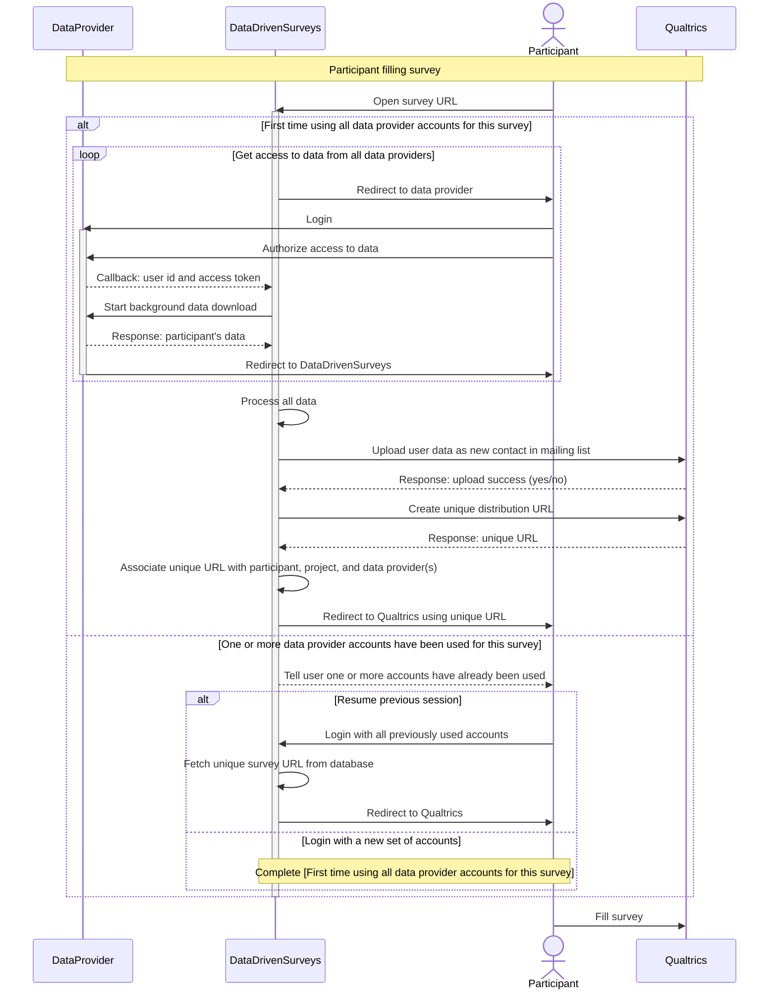

# Participant Usage Sequence Diagram

TODO: update diagram to match mockups

```mermaid
sequenceDiagram
  participant dp as DataProvider
  participant dds as DataDrivenSurveys
  actor p as Participant
  participant q as Qualtrics
  
  
  Note over dp,q: Participant filling survey
  p->>dds: Open survey URL
  activate dds
  alt First time using all data provider accounts for this survey
    loop Get access to data from all data providers
      dds->>p: Redirect to data provider
      p->>dp: Login
      activate dp
      p->>dp: Authorize access to data
      dp-->>dds: Callback: user id and access token
      dds->>dp: Start background data download
      dp-->>dds: Response: participant's data
      dp->>p: Redirect to DataDrivenSurveys
      deactivate dp
    end
    dds->>dds: Process all data
    dds->>q: Upload user data as new contact in mailing list
    q-->>dds: Response: upload success (yes/no)
    dds->>q: Create unique distribution URL
    q-->>dds: Response: unique URL
    dds->>dds: Associate unique URL with participant, project, and data provider(s)
    dds->>p: Redirect to Qualtrics using unique URL
  else One or more data provider accounts have been used for this survey
    dds-->>p: Tell user one or more accounts have already been used
    alt Resume previous session
        p->>dds: Login with all previously used accounts
        dds->>dds: Fetch unique survey URL from database
        dds->>p: Redirect to Qualtrics
    else Login with a new set of accounts
        Note over dds,p: Complete [First time using all data provider accounts for this survey]
    end
  end
  deactivate dds
  
  p->>q: Fill survey

```

