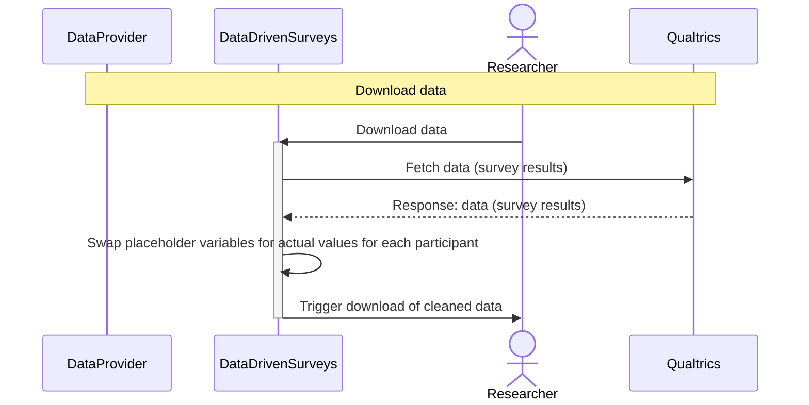

# Sequence Diagram: Researcher Download's Data

```mermaid
sequenceDiagram
  participant dp as DataProvider
  participant dds as DataDrivenSurveys
  actor r as Researcher
  participant q as Qualtrics
  
  Note over dp,q: Download data
  r->>dds: Download data
  activate dds
  dds->>q: Fetch data (survey results)
  q-->>dds: Response: data (survey results)
  dds->>dds: Swap placeholder variables for actual values for each participant
  dds->>r: Trigger download of cleaned data
  deactivate dds
```
